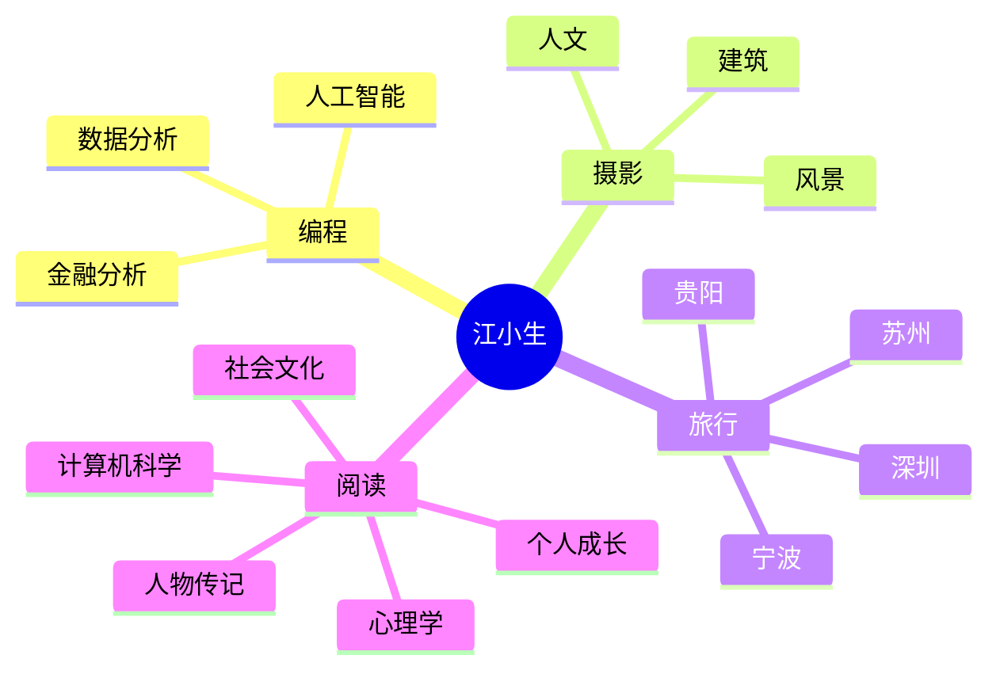

 

## ⚡ about.me

> We're making the world a better place.
> Through constructing elegant hierarchies for maximum code reuse and extensibility.

  

 

## 🧠 interests

 

## 🛠️ tech_stack

 

 

## 📊 stats

 

 

---

**[🌐 MY SITE](https://onecany.github.io)** · **[GH PROFILE](https://github.com/onecany)** · **[X/TWITTER](https://twitter.com/onecany)**

 

