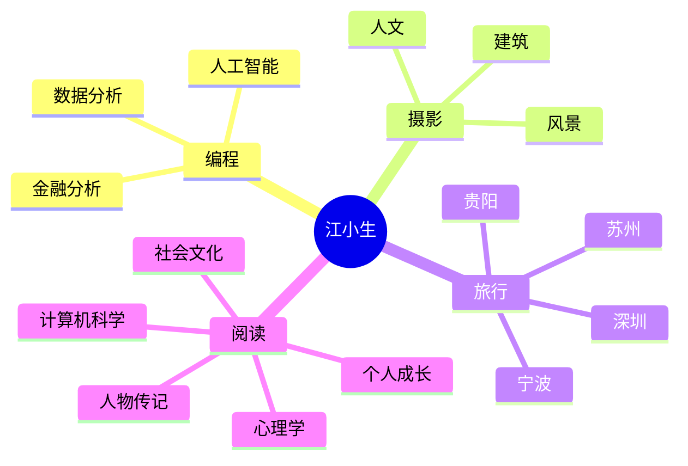

 

## ⚡ about.me

> We're making the world a better place.
> Through constructing elegant hierarchies for maximum code reuse and extensibility.

  

 

## 🧠 interests

```mermaid
mindmap
  root((江小生))
    编程
      金融分析
      数据分析
      人工智能
    摄影
      人文
      建筑
      风景
    旅行
      苏州
      深圳
      贵阳
      宁波
    阅读
      人物传记
      个人成长
      社会文化
      心理学
      计算机科学
```

 

## 🛠️ tech_stack

 

 

## 📦 projects

| Project | Stack | Description |
| :--- | :--- | :--- |
| **Financial Analysis Toolkit** | Python / Pandas | Data collection, cleaning, visualization, automated reporting |
| **AI Data Pipeline** | PyTorch / Python | End-to-end ML pipeline with automated feature engineering |
| **Web Architecture Lab** | TypeScript / Go | RESTful APIs, microservices patterns, component design systems |
| **Automation Scripts** | Bash / Python | DevOps automation, data processing, workflow optimization |
| **Data Dashboard** | Python / SQL | Real-time interactive visualization for monitoring and analysis |

 

## 📊 stats

 

---

**[🌐 MY SITE](https://onecany.github.io)** · **[GH PROFILE](https://github.com/onecany)** · **[X/TWITTER](https://twitter.com/onecany)**

 

